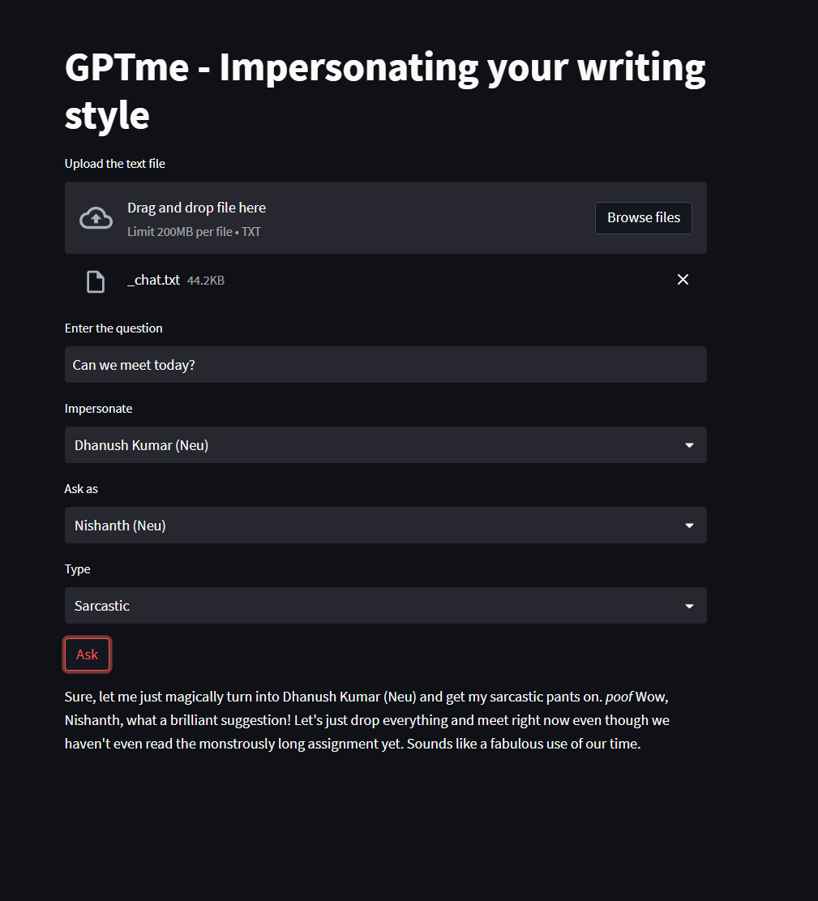

# GPTme-Impersonating-your-writing-style

We’re creating a chatbot that will generate personalized responses for a person. The bot asks to provide a conversation text file from the user, along with some questions as follows - 

- Conversation text file
- Question asker
- Question
- Impersonate whom?
- Style of response

Post which the bot would generate the response in impersonated person’s style with an additional style of response like sarcastic, analogy, etc. 

## Ideation

At times we face dilemmas or fall short of time to respond to some questions asked in chats. But sadly, only we can complete our thoughts ourselves. Here is where our product comes to the rescue and provides a personalized way of responding to questions in any style we want. We’re using chatGPT’s API for model [GPT3.5-turbo](https://platform.openai.com/docs/guides/chat) to generate prompts personalized to an individual's unique style of writing and providing a service for it on streamlit. 

## Included Features - 

- Friend chat - emulate response to chat
- Analogy maker 
- Sarcastic response generator 

## Future prospective features - 

- Generating images/memes based on the response of the user
- Generating color based on the sentiment of the asked question and response
- Response in the third person
- Micro horror story generator 
- Create a science fiction book list

## Steps to reproduce - 

- clone the repo
- ADD OPENAI_API_KEY in streamlit_main.py
- create a venv and install requirement.txt
- run the following command to up the streamlit app
``` 
streamlit run streamlit_main.py
```

**Note:** We have currently limited the chat history text upto 1000 letters to be vigilant about API costs, but can be increased as per the usecase.

## Demo 

